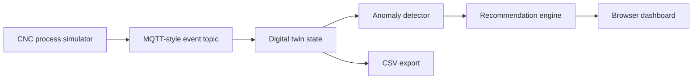

# Mini Manufacturing Digital Twin

A zero-install Python demo for manufacturing process monitoring, anomaly detection, and operator decision support.

This project was built as an Autodesk Research interview artifact. It shows how a physical manufacturing process can be represented as a live data stream, compared against an expected process model, checked for anomalies, and translated into auditable recommendations.

For the full technical write-up with simulation examples, see [REPORT.md](REPORT.md).
For a PDF version, see [Mini Manufacturing Digital Twin Technical Report](output/pdf/Mini_Manufacturing_Digital_Twin_Technical_Report.pdf).

## What It Shows

- CNC-style machine telemetry
- MQTT-style topic envelope: `factory/BTC-CNC-01/process`
- Expected vs actual process behavior
- Lightweight digital twin state
- Anomaly detection for chatter, tool wear, thermal drift, feed mismatch, and sensor dropout
- Human-in-the-loop recommendation logic
- Browser dashboard with live charts and CSV export

## Why This Fits Autodesk Research

The role emphasizes hands-on experimentation across manufacturing, sensing, automation, real-world data, AI-assisted workflows, and digital-thread thinking. This demo is intentionally small, but it reflects that workflow:

1. Start with the physical process.
2. Stream machine data.
3. Compare measured behavior against an expected model.
4. Detect deviations.
5. Recommend action only when the evidence is strong enough.
6. Keep the decision auditable and human-reviewable.

## Architecture



## Project Structure

```text
mini-manufacturing-digital-twin/
  app.py
  simulator.py
  detector.py
  recommender.py
  requirements.txt
  README.md
  data/
    sample_run.csv
  static/
    index.html
    styles.css
    dashboard.js
```

## Run

This project uses only the Python standard library.

```bash
python3 app.py
```

Then open:

```text
http://127.0.0.1:8765
```

## Generate Sample Data

```bash
python3 app.py --generate-sample
```

The generated CSV is written to:

```text
data/sample_run.csv
```

## API Endpoints

```text
GET /api/next
GET /api/next?count=10
GET /api/status
GET /api/reset
GET /api/export.csv
GET /data/sample_run.csv
```

## Simulated Signals

Each event includes:

- timestamp
- machine_id
- part_id
- operation
- process_phase
- spindle_speed_rpm
- feed_rate_mm_min
- spindle_load_pct
- vibration_rms
- temperature_c
- tool_wear_pct
- expected_load_pct
- expected_temperature_c
- anomaly_label

## Anomalies

The simulator creates repeatable anomaly windows:

- Chatter: vibration spike plus elevated load
- Tool wear: rising load, vibration, and wear estimate
- Thermal drift: actual temperature rises above expected model
- Feed mismatch: feed rate exits the validated process window
- Sensor dropout: missing telemetry blocks automated recommendations

## Interview Explanation

"I built this because the Autodesk role emphasizes industrial data, digital twins, anomaly detection, and practical AI for manufacturing. The prototype streams simulated CNC data, compares expected and actual process behavior, detects anomalies like chatter and thermal drift, and produces operator-facing recommendations. It is deliberately lightweight, but it shows the workflow I would bring to Autodesk Research: understand the physical process, measure it, compare it to a model, detect deviations, and gate action with confidence and human review."

## Honest Scope

This is not a production digital twin and does not connect to a real broker or CNC controller. It is a compact prototype that demonstrates the architecture and engineering judgment. A production version would connect to MQTT, MTConnect, OPC UA, or machine-controller APIs; persist time-series data; validate detectors against real process data; and add role-based review workflows.
