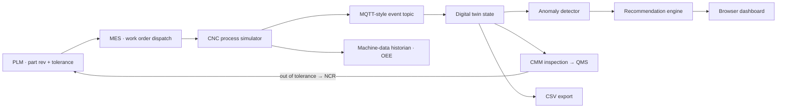

# Mini Manufacturing Digital Twin

A zero-install Python demo for manufacturing process monitoring, anomaly detection, and operator decision support.

I built this as a teaching project to make manufacturing process monitoring concrete: it shows how a physical cut can be represented as a live data stream, compared against an expected process model, checked for anomalies, and translated into auditable recommendations — so machining reads as data, not just chips.

For the full technical write-up with simulation examples, see [REPORT.md](REPORT.md).
For a PDF version, see [Mini Manufacturing Digital Twin Technical Report](output/pdf/Mini_Manufacturing_Digital_Twin_Technical_Report.pdf).

## What It Shows

- CNC-style machine telemetry
- MQTT-style topic envelope: `factory/SEAS-CNC-01/process`
- Expected vs actual process behavior
- Lightweight digital twin state
- Anomaly detection for chatter, tool wear, thermal drift, feed mismatch, and sensor dropout
- Human-in-the-loop recommendation logic
- Enterprise systems of record wired into the loop — PLM (part/revision/tolerance/ECO), MES (work order, dispatch, OEE-driven hold), QMS (non-conformance and disposition), and a machine-data historian — driving a closed-loop scenario: a thermal drift makes a part measure out of tolerance, QMS raises an NCR, PLM releases an engineering change, and MES re-dispatches the corrected revision
- Interactive browser platform: a top-down factory-floor digital-thread map, protocol and packet inspector, CNC sensor guide, a bracket-milling case study, live charts, and CSV export

## Walking through the platform

Running the app opens an interactive engineering platform, not just a chart page. It walks top to bottom through the digital-twin loop:

- A live overview pairing the physical CNC process with its digital replica.
- A top-down **factory-floor digital-thread map** showing the enterprise systems of record (PLM, MES, QMS, and the machine-data historian), the engineering office (CAD/CAE/CAM), the machine shop (CNC cell with live HMI), the automation line (robot cell and PLC), inspection (CMM and quality), and the edge/twin platform (edge gateway, MTConnect, OPC UA, MQTT, API, and the twin dashboard). Animated data threads carry design intent and dispatched work orders down to production, telemetry and as-built state back up, and a corrective change loop (CMM → QMS → PLM → MES) that visibly lights up whenever a non-conformance is open. Every station shows live state, and warning/critical conditions propagate across the affected cells and flows.
- A **packet inspector** with an MQTT / OPC UA / MTConnect / REST protocol selector, so the telemetry envelope is tangible.
- A **CNC sensor guide** that ties each signal (spindle load, vibration, temperature, feed, tool wear) to the detector rule that uses it.
- A **bracket-milling case study** with the machining cell shown alongside the live simulated state.
- The core Load / Thermal / Vibration charts, decision-support panel, anomaly evidence, and latest-event view.

See [V2_PLATFORM_PLAN.md](V2_PLATFORM_PLAN.md) for the platform architecture and phased build plan.

## The workflow it teaches

The point is the loop a good operator runs in their head — made explicit:

1. Start with the physical process.
2. Stream machine data.
3. Compare measured behavior against an expected model.
4. Detect deviations.
5. Recommend action only when the evidence is strong enough.
6. Keep the decision auditable and human-reviewable.

## Architecture



## Project Structure

```text
mini-manufacturing-digital-twin/
  app.py
  simulator.py
  detector.py
  recommender.py
  requirements.txt
  README.md
  V2_PLATFORM_PLAN.md
  assets/
    cnc-digital-twin-cell.png
  data/
    sample_run.csv
  static/
    index.html
    styles.css
    dashboard.js
```

## Run

This project uses only the Python standard library.

```bash
python3 app.py
```

Then open:

```text
http://127.0.0.1:8765
```

## Generate Sample Data

```bash
python3 app.py --generate-sample
```

The generated CSV is written to:

```text
data/sample_run.csv
```

## API Endpoints

```text
GET /api/next
GET /api/next?count=10
GET /api/status
GET /api/reset
GET /api/export.csv
GET /data/sample_run.csv
```

## Simulated Signals

Each event includes:

- timestamp
- machine_id
- part_id
- operation
- process_phase
- spindle_speed_rpm
- feed_rate_mm_min
- spindle_load_pct
- vibration_rms
- temperature_c
- tool_wear_pct
- expected_load_pct
- expected_temperature_c
- anomaly_label
- work_order, part_revision, tolerance_um (PLM/MES context)
- eco_id, ncr_id, disposition (PLM/QMS change and quality state)
- cmm_deviation_um, cmm_verdict (inspection result fed to QMS/SPC)
- mes_state, oee_pct (MES execution state and machine-data OEE rollup)

## Anomalies

The simulator creates repeatable anomaly windows:

- Chatter: vibration spike plus elevated load
- Tool wear: rising load, vibration, and wear estimate
- Thermal drift: actual temperature rises above expected model
- Feed mismatch: feed rate exits the validated process window
- Sensor dropout: missing telemetry blocks automated recommendations

## Honest Scope

This is not a production digital twin and does not connect to a real broker or CNC controller. It is a compact prototype that demonstrates the architecture and engineering judgment. The PLM, MES, QMS, and machine-data stations are simulated systems of record — their state is scripted to tell a repeatable closed-loop story, not read from Teamcenter/Windchill, Opcenter/FactoryTalk, a quality module, or a historian. A production version would connect to MQTT, MTConnect, OPC UA, or machine-controller APIs for telemetry; integrate the real enterprise systems over their APIs (e.g. work orders from MES, released revisions and ECOs from PLM, non-conformances from QMS); persist time-series data; validate detectors against real process data; and add role-based review workflows.
