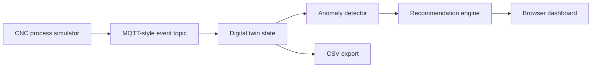

# Mini Manufacturing Digital Twin

A zero-install Python demo for manufacturing process monitoring, anomaly detection, and operator decision support.

I built this for **ES 51, Computer-Aided Machine Design**, the course I teach at Harvard SEAS, where students machine their own parts on the lathe and mill. It is the **monitoring** end of the design → make → monitor thread: it shows how a physical cut can be represented as a live data stream, compared against an expected process model, checked for anomalies, and translated into auditable recommendations — so students can see the machining as data, not just chips.

It is the **back half** of a digital thread. Its companion, [`additive-build-advisor`](https://github.com/Seymurhh/additive-build-advisor), is the front half: it takes a part from CAD through build-prep and flags the features FFF cannot hold as-built. When students take that part to the CNC to finish those features, this twin watches the cut.

For the full technical write-up with simulation examples, see [REPORT.md](REPORT.md).
For a PDF version, see [Mini Manufacturing Digital Twin Technical Report](output/pdf/Mini_Manufacturing_Digital_Twin_Technical_Report.pdf).

## What It Shows

- CNC-style machine telemetry
- MQTT-style topic envelope: `factory/SEAS-CNC-01/process`
- Expected vs actual process behavior
- Lightweight digital twin state
- Anomaly detection for chatter, tool wear, thermal drift, feed mismatch, and sensor dropout
- Human-in-the-loop recommendation logic
- Interactive browser platform: animated factory data-flow, protocol and packet inspector, CNC sensor guide, a bracket-milling case study, live charts, and CSV export

## Walking through the platform

Running the app opens an interactive engineering platform, not just a chart page. It walks top to bottom through the digital-twin loop:

- A live overview pairing the physical CNC process with its digital replica.
- An animated **factory data-flow** map (machine to edge gateway to protocol broker to twin model to operator dashboard) with clickable nodes.
- A **packet inspector** with an MQTT / OPC UA / MTConnect / REST protocol selector, so the telemetry envelope is tangible.
- A **CNC sensor guide** that ties each signal (spindle load, vibration, temperature, feed, tool wear) to the detector rule that uses it.
- A **bracket-milling case study** with the machining cell shown alongside the live simulated state.
- The core Load / Thermal / Vibration charts, decision-support panel, anomaly evidence, and latest-event view.

See [V2_PLATFORM_PLAN.md](V2_PLATFORM_PLAN.md) for the platform architecture and phased build plan.

## The workflow it teaches

The point, for ES 51, is the loop a good operator runs in their head — made explicit:

1. Start with the physical process.
2. Stream machine data.
3. Compare measured behavior against an expected model.
4. Detect deviations.
5. Recommend action only when the evidence is strong enough.
6. Keep the decision auditable and human-reviewable.

## Architecture



## Project Structure

```text
mini-manufacturing-digital-twin/
  app.py
  simulator.py
  detector.py
  recommender.py
  requirements.txt
  README.md
  V2_PLATFORM_PLAN.md
  assets/
    cnc-digital-twin-cell.png
  data/
    sample_run.csv
  static/
    index.html
    styles.css
    dashboard.js
```

## Run

This project uses only the Python standard library.

```bash
python3 app.py
```

Then open:

```text
http://127.0.0.1:8765
```

## Generate Sample Data

```bash
python3 app.py --generate-sample
```

The generated CSV is written to:

```text
data/sample_run.csv
```

## API Endpoints

```text
GET /api/next
GET /api/next?count=10
GET /api/status
GET /api/reset
GET /api/export.csv
GET /data/sample_run.csv
```

## Simulated Signals

Each event includes:

- timestamp
- machine_id
- part_id
- operation
- process_phase
- spindle_speed_rpm
- feed_rate_mm_min
- spindle_load_pct
- vibration_rms
- temperature_c
- tool_wear_pct
- expected_load_pct
- expected_temperature_c
- anomaly_label

## Anomalies

The simulator creates repeatable anomaly windows:

- Chatter: vibration spike plus elevated load
- Tool wear: rising load, vibration, and wear estimate
- Thermal drift: actual temperature rises above expected model
- Feed mismatch: feed rate exits the validated process window
- Sensor dropout: missing telemetry blocks automated recommendations

## Where it fits the digital thread

The `additive-build-advisor` releases a part with an explicit hand-off block — machine id, part id, expected operation, and the signals to watch. That becomes this twin's as-built monitoring context: design intent flowing all the way through to the as-machined part. Front half decides *how to make it*; back half watches it *being made*. Same verify-before-act discipline at both ends — a model may recommend, but a physical action is gated on the evidence and on a human-review path when anything is uncertain.

## Honest Scope

This is not a production digital twin and does not connect to a real broker or CNC controller. It is a compact prototype that demonstrates the architecture and engineering judgment. A production version would connect to MQTT, MTConnect, OPC UA, or machine-controller APIs; persist time-series data; validate detectors against real process data; and add role-based review workflows.
