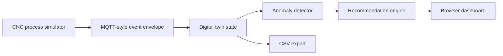

# Technical Report: Mini Manufacturing Digital Twin

## Executive Summary

This project is a compact, zero-install digital twin prototype for manufacturing process monitoring. It simulates a CNC milling process, streams machine events through an MQTT-style topic envelope, compares measured behavior against an expected process model, detects anomalies, and converts those detections into operator-facing recommendations.

The goal is not to claim a production-ready digital twin. The goal is to demonstrate the engineering workflow behind one:

1. Define the physical process and measurable signals.
2. Stream machine-state data.
3. Maintain an expected process model.
4. Compare actual behavior against expected behavior.
5. Detect deviations.
6. Recommend action with confidence and human-review gates.

This maps directly to manufacturing R&D work where digital models, sensor data, automation, and decision support need to be connected in a practical way.

## Project Objective

The prototype was built to address common gaps in an applied manufacturing-AI profile:

- Industrial data stream thinking
- Digital twin workflow design
- Machine telemetry interpretation
- Manufacturing anomaly detection
- Human-in-the-loop automation
- Safe decision support for physical systems

The project uses only the Python standard library so it can run easily on a local machine without package installation.

## System Architecture



### Components

| Component | File | Role |
|---|---|---|
| Process simulator | `simulator.py` | Generates repeatable CNC-style machine telemetry and anomaly windows. |
| Anomaly detector | `detector.py` | Compares observed signals against expected behavior and threshold logic. |
| Recommendation engine | `recommender.py` | Converts anomaly evidence into auditable operator recommendations. |
| Web server/API | `app.py` | Serves the dashboard and exposes local API endpoints. |
| Dashboard UI | `static/index.html`, `static/styles.css`, `static/dashboard.js` | Displays live status, charts, anomaly evidence, and recommended actions. |
| Smoke test | `tests/smoke_test.py` | Verifies that simulated anomalies are generated, detected, and routed to decisions. |

## Digital Twin Definition Used Here

For this prototype, the digital twin is a lightweight live state model of a manufacturing process. It includes:

- Current machine state
- Current part and operation
- Current process phase
- Expected process behavior
- Actual sensor-like measurements
- Health score
- Anomaly evidence
- Recommended next action

This is intentionally smaller than an industrial digital twin. A production version would connect to a live CNC controller, MQTT broker, MTConnect adapter, OPC UA server, or historian. It would also persist time-series data and validate models against real process outcomes.

## Simulated Manufacturing Process

The simulated process is an adaptive CNC milling operation for a bracket-like part on machine `BTC-CNC-01`.

The process cycles through four phases:

| Phase | Purpose | Typical behavior |
|---|---|---|
| `warmup` | Bring machine/process into stable operating range | Low load, low vibration, moderate temperature |
| `roughing` | High material-removal operation | High load, higher vibration, elevated temperature |
| `finishing` | Lower-load precision pass | Moderate load, lower vibration |
| `inspection` | Low-motion measurement/check phase | Low load, low feed rate |

Each generated event includes the topic:

```text
factory/BTC-CNC-01/process
```

That topic is MQTT-style but the current implementation does not require a broker. This keeps the demo zero-install while preserving the event shape expected in an industrial streaming architecture.

## Event Schema

Each event contains:

| Field | Meaning |
|---|---|
| `timestamp` | UTC event timestamp |
| `sequence` | Event index in the simulated run |
| `topic` | MQTT-style topic envelope |
| `machine_id` | Simulated machine identifier |
| `part_id` | Simulated part identifier |
| `operation` | Manufacturing operation |
| `process_phase` | Current phase: warmup, roughing, finishing, inspection |
| `spindle_speed_rpm` | Simulated spindle speed |
| `feed_rate_mm_min` | Simulated feed rate |
| `spindle_load_pct` | Actual load measurement |
| `vibration_rms` | Actual vibration signal |
| `temperature_c` | Actual temperature signal |
| `tool_wear_pct` | Estimated tool wear |
| `expected_load_pct` | Expected load from the process model |
| `expected_temperature_c` | Expected temperature from the process model |
| `anomaly_label` | Ground-truth simulated anomaly label |

## Expected Process Model

The simulator creates expected behavior for load and temperature using phase-specific baselines plus low-amplitude variation. For example:

- Roughing has higher expected spindle load than finishing.
- Inspection has low expected load and feed rate.
- Temperature shifts by phase and varies gradually.

This expected model is deliberately simple. The point is to demonstrate the twin workflow: compare actual behavior with expected behavior and reason about the residuals.

## Simulated Anomalies

The simulator injects repeatable anomaly windows so the dashboard and detector behavior are reproducible.

| Anomaly | Simulated behavior | Manufacturing interpretation |
|---|---|---|
| `chatter` | Vibration spike plus elevated load | Unstable cutting, poor fixturing, tool engagement issue |
| `tool_wear` | Rising load, rising vibration, higher wear estimate | Tool degradation affecting quality and repeatability |
| `thermal_drift` | Temperature rises above expected process behavior | Dimensional risk due to heat, coolant issue, compensation issue |
| `feed_mismatch` | Feed rate exits the validated process window | Incorrect override, wrong parameter set, operation mismatch |
| `sensor_dropout` | Load, vibration, and temperature become missing | Telemetry failure, model should not make automated decisions |

## Detection Logic

The detector uses transparent rules rather than a black-box model:

- Load residual: actual load minus expected load
- Temperature residual: actual temperature minus expected temperature
- Rolling z-score for load, temperature, and vibration
- Phase-specific vibration limits
- Phase-specific feed-rate windows
- Tool-wear threshold
- Missing telemetry checks

This is the right first step for a short prototype because it is explainable. In a production system, these rules could become baselines for comparison against ML models such as isolation forests, autoencoders, or supervised defect classifiers.

## Recommendation Logic

The recommender converts detection evidence into decisions:

| Decision | Meaning |
|---|---|
| `proceed` | Continue under nominal monitoring |
| `watch` | Continue but observe the next samples |
| `human_review` | Require operator or engineer review before continuing normally |
| `schedule_intervention` | Schedule tool or process intervention at the next safe stop |
| `do_not_proceed` | Stop automated progression until a required check is complete |

Two conditions are intentionally treated as high priority:

- Sensor dropout: the system should not recommend process changes when telemetry is missing.
- Feed mismatch: invalid process parameters should block automated continuation.

This follows a verify-before-act pattern: the model can recommend, but physical actions should be gated by evidence and constraints.

## Simulation Results

The smoke test generated 240 events. The simulator produced all planned anomaly types.

### Simulated Labels

| Label | Count |
|---|---:|
| `normal` | 183 |
| `chatter` | 9 |
| `tool_wear` | 18 |
| `thermal_drift` | 17 |
| `feed_mismatch` | 7 |
| `sensor_dropout` | 6 |

### Detected Codes

| Detection code | Count |
|---|---:|
| `load_residual` | 25 |
| `chatter_risk` | 24 |
| `thermal_drift` | 18 |
| `tool_wear` | 96 |
| `feed_mismatch` | 7 |
| `sensor_dropout` | 6 |

The tool-wear detector remains active beyond the ground-truth tool-wear injection window because the wear estimate continues rising. That is realistic for a cumulative degradation signal: once tool wear is high, it remains operationally relevant.

### Recommendation Distribution

| Recommendation | Count |
|---|---:|
| `proceed` | 104 |
| `watch` | 14 |
| `human_review` | 23 |
| `schedule_intervention` | 86 |
| `do_not_proceed` | 13 |

## Representative Simulation Examples

The table below shows one representative event per scenario from the deterministic simulation run.

| Scenario | Seq | Phase | Load vs expected | Temp vs expected | Vib | Wear | Detected codes | Decision | Action |
|---|---:|---|---:|---:|---:|---:|---|---|---|
| `normal` | 0 | warmup | 27.29 vs 28.0 | 28.42 vs 28.0 | 0.251 | 4.43 | none | `proceed` | Continue process under nominal monitoring. |
| `chatter` | 46 | roughing | 69.34 vs 58.12 | 41.28 vs 41.96 | 1.212 | 11.82 | `load_residual`, `chatter_risk` | `human_review` | Reduce feed 10-15%, inspect fixturing, and check tool engagement. |
| `tool_wear` | 91 | roughing | 82.66 vs 66.11 | 43.21 vs 44.1 | 0.521 | 37.76 | `load_residual`, `tool_wear` | `schedule_intervention` | Schedule tool inspection or replacement at the next safe stop. |
| `thermal_drift` | 137 | finishing | 44.78 vs 42.72 | 51.72 vs 37.91 | 0.322 | 28.49 | `thermal_drift` | `human_review` | Check coolant, ambient conditions, and thermal compensation before continuing. |
| `feed_mismatch` | 174 | inspection | 27.84 vs 17.89 | 30.94 vs 31.96 | 0.334 | 35.81 | `load_residual`, `chatter_risk`, `tool_wear`, `feed_mismatch` | `do_not_proceed` | Reject the current parameter set and restore the validated feed-rate window. |
| `sensor_dropout` | 208 | roughing | missing | missing | missing | 41.48 | `sensor_dropout` | `do_not_proceed` | Pause automated decisions until telemetry is restored. |

## Case Discussion

### Normal Operation

At sequence 0, the system is in warmup. Actual load and temperature are close to expected values. The detector does not report any anomaly code, the health score remains high, and the recommendation is to proceed.

This is the baseline behavior a manufacturing dashboard needs: do not overreact to normal process variation.

### Chatter

At sequence 46, the process is in roughing. Load rises to 69.34% against an expected 58.12%, and vibration reaches 1.212 RMS. The detector reports both `load_residual` and `chatter_risk`.

The recommendation is `human_review`, not an automatic stop. That is intentional. A vibration spike may require inspection of fixturing, tool engagement, or cut surface before deciding whether to stop or modify parameters.

### Tool Wear

At sequence 91, the estimated tool wear reaches 37.76%. The load is also significantly above expected behavior. The detector reports `load_residual` and `tool_wear`.

The recommendation is `schedule_intervention`. This reflects the difference between a process emergency and a maintenance action. Tool wear may not require immediate stop, but it should trigger inspection or replacement at a safe transition point.

### Thermal Drift

At sequence 137, temperature is 51.72 C against an expected 37.91 C. The detector flags `thermal_drift`.

The recommendation is `human_review` because thermal drift can affect tolerances and dimensional-critical features. The operator should check coolant, ambient conditions, thermal compensation, and critical measurements.

### Feed Mismatch

At sequence 174, the process is in inspection, but the feed rate is outside the validated inspection-phase window. The detector reports `feed_mismatch` along with secondary symptoms.

The recommendation is `do_not_proceed`. Invalid process parameters should be treated as a constraint violation, not merely a warning.

### Sensor Dropout

At sequence 208, load, vibration, and temperature are missing. The detector reports `sensor_dropout`.

The recommendation is `do_not_proceed`. This is a key safety principle: when the data is missing, the model should not confidently recommend physical process changes.

## Dashboard Behavior

The browser dashboard shows:

- Machine ID
- Part ID
- Current phase
- Health score
- Severity
- Sample count
- Load model chart
- Thermal model chart
- Vibration chart
- Anomaly evidence
- Latest event values
- Decision support recommendation

The dashboard polls `/api/next` and updates live. It can also export the current history through `/api/export.csv`.

## API Summary

| Endpoint | Purpose |
|---|---|
| `GET /` | Browser dashboard |
| `GET /api/next` | Generate and return the next event |
| `GET /api/next?count=10` | Generate multiple events |
| `GET /api/status` | Return current history and latest state |
| `GET /api/reset` | Reset simulator, detector, and history |
| `GET /api/export.csv` | Export current event history |
| `GET /data/sample_run.csv` | Download deterministic sample data |

## Validation

The current validation is a smoke test:

```bash
python3 tests/smoke_test.py
```

Expected result:

```text
Smoke test passed
```

The test verifies that:

- Each anomaly type is generated.
- Key detection codes appear.
- Multiple recommendation categories are produced.
- High-risk states reach `do_not_proceed`.

The project also compiles cleanly:

```bash
python3 -m compileall .
```

## Limitations

This prototype is intentionally scoped. It does not include:

- Real CNC controller integration
- Real MQTT broker
- MTConnect or OPC UA connection
- Persistent time-series database
- Authentication or user roles
- Real sensor calibration
- Real process validation
- ML model training

These limitations should be stated clearly. The value of the project is the architecture and decision logic, not a claim of production readiness.

## Production Extension Plan

A production-oriented version would add:

1. MQTT broker integration using `paho-mqtt`
2. MTConnect or OPC UA adapter for real machine data
3. Time-series persistence with InfluxDB, TimescaleDB, or similar
4. Real process baseline calibration
5. Detector benchmarking against labeled fault data
6. Human review workflow with operator acknowledgments
7. Alerting through Slack, email, or maintenance systems
8. CAD/CAM context from Fusion or manufacturing metadata
9. Model versioning for anomaly detectors
10. Closed-loop feedback after operator action

## GitHub Readiness Checklist

Before pushing to GitHub:

- Keep `README.md` concise and demo-focused.
- Keep this `REPORT.md` as the detailed technical explanation.
- Add one screenshot or short GIF of the dashboard.
- Confirm `python3 tests/smoke_test.py` passes.
- Confirm `python3 app.py` starts the dashboard.
- Add a short repository description:

```text
Mini digital twin for CNC-style manufacturing process monitoring, anomaly detection, and operator decision support.
```

Suggested repository name:

```text
mini-manufacturing-digital-twin
```

Suggested topics:

```text
digital-twin, manufacturing, anomaly-detection, cnc, industrial-ai, process-monitoring, decision-support
```

## Interview Explanation

Use this concise version:

"I built a mini manufacturing digital twin to close my gap around industrial data and digital-twin workflows. The system streams simulated CNC telemetry, compares actual values against an expected process model, detects anomalies like chatter, tool wear, thermal drift, feed mismatch, and sensor dropout, and converts those detections into operator-facing recommendations. I intentionally kept the detector transparent and human-reviewable because in manufacturing, an AI recommendation should be grounded in physical evidence and should not automatically act when telemetry or constraints are unreliable."

## Strong Follow-Up Line

"The most important design choice was not the dashboard. It was the gating logic. A model can detect or recommend, but physical action should depend on signal quality, process constraints, and confidence. That is the same verify-before-act pattern I used in my robotic manipulation work."
